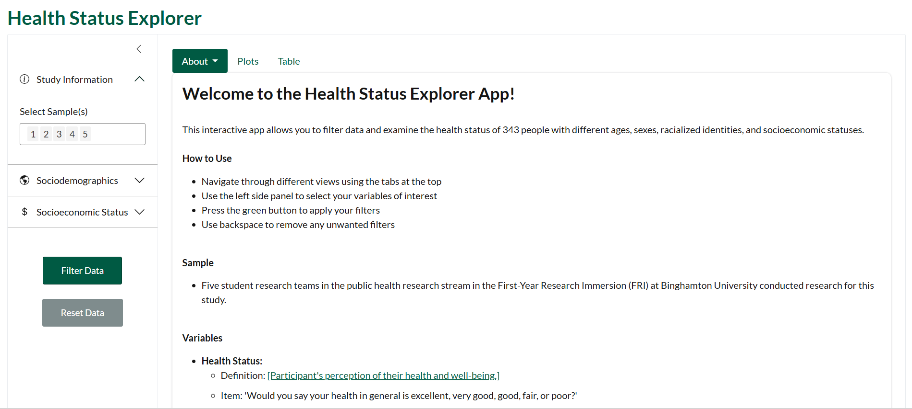

## Health Status Explorer

### Purpose

This interactive app allows you to filter data and examine the health status of 343 people with different ages, sexes, racialized identities, and socioeconomic statuses.

### Study Participants

Five student research teams in the public health research stream in the First-Year Research Immersion (FRI) at Binghamton University conducted research for this study.

## Shiny Interface

View the final app [here](https://zachspiegel.shinyapps.io/HealthStatusExplorer/).

**How to Use**

-   Navigate through different views using the tabs at the top

-   Use the left side panel to select your variables of interest

-   Press the green button to apply your filters

-   Use backspace to remove any unwanted filters

## Project Files

Health_Status_App Folder:

-   app.R: Contains the code that renders and the app

-   health_status_data.csv: Contains data used for analysis

-   \_brand.yml: Custom theming for app

-   www (images) Folder:

    -   favicon.png: Custom icon in browser

    -   Logo_FRI.png: Logo for the First-Year Research Immersion Program

## Authors & Citation

This R shiny app was developed in the Public Health stream of the First-Year Research Immersion (FRI) program at Binghamton University.

-   **R Shiny App Development:** Spiegel, Z.

-   **Ggplot2 Data Visualization:** Silhavy, A. & Spiegel, Z.

-   **Data Cleaning:** Papavangjeli, S., MacDuff, A., Volpe, M., Spiegel, Z.

-   **Data Collection:** Al-Aubaidy, S., Anemone, A., Baskar, S., Cheng., M., Estreich, M., Fumarola, G., Giallella, J., Goldberg, M., Guevarra, C., Hei, Z., John, J., Kang, M., Katz, O., Khan, A., Lewinson, I., Menon, P., Perez, K., Rualo, G., Santiago, J., Santos, A., Sava, E., Schaefer, B., Soler, A., Wayland-Smith, A., Wayne, H., Yousef, L.

-   **Research Mentors:** Peters, M. & McCarty, S.

-   **Citation for Shiny App:** Silhavy, A., Spiegel, Z. & McCarty, S. Health & Social Status Explorer \[Shiny web application\]. Retrieved from https://zachspiegel.shinyapps.io/HealthStatusExplorer/
